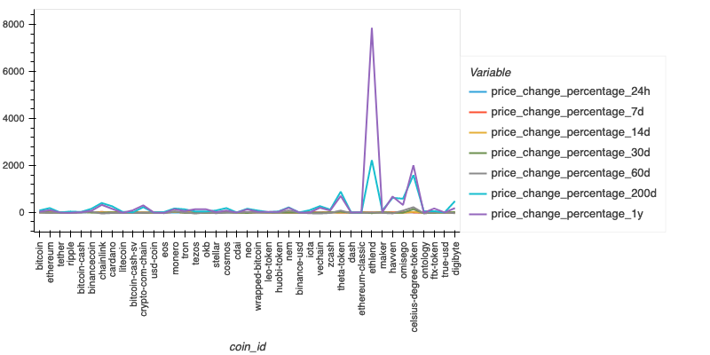
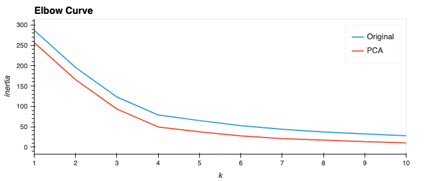
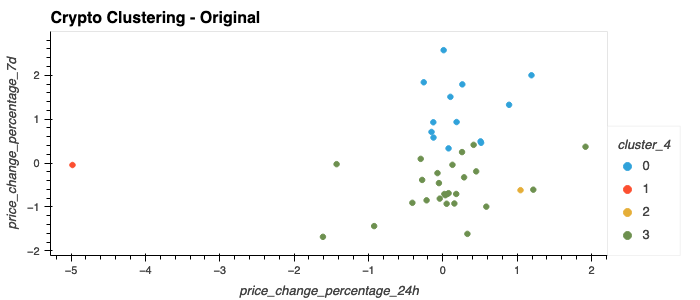
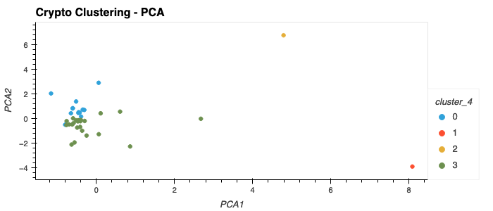

# Crypto Clustering

In this project, we cluster cryptocurrencies by their performance in different time periods. The following plot shows the price change percentages for different cryptocurrencies. 

We use the StandardScaler module from scikit-learn to normalize the CSV file data. Here are the first 5 rows of the normalized data:

|      |price_change_percentage_24h|price_change_percentage_7d|price_change_percentage_14d|price_change_percentage_30d|price_change_percentage_60d|price_change_percentage_200d|price_change_percentage_1y|
|------------|---------------------------|--------------------------|---------------------------|---------------------------|---------------------------|----------------------------|--------------------------|
|coin_id     |                           |                          |                           |                           |                           |                            |                          |
|bitcoin     |0.508529                   |0.493193                  |0.7722                     |0.23546                    |-0.067495                  |-0.355953                   |-0.251637                 |
|ethereum    |0.185446                   |0.934445                  |0.558692                   |-0.054341                  |-0.273483                  |-0.115759                   |-0.199352                 |
|tether      |0.021774                   |-0.706337                 |-0.02168                   |-0.06103                   |0.008005                   |-0.550247                   |-0.282061                 |
|ripple      |-0.040764                  |-0.810928                 |0.249458                   |-0.050388                  |-0.373164                  |-0.458259                   |-0.295546                 |
|bitcoin-cash|1.193036                   |2.000959                  |1.76061                    |0.545842                   |-0.291203                  |-0.499848                   |-0.270317                 |

We tried two methods to cluster the cryptocurrencies with KMeans, one using the original data, one using a PCA model with 3 components. The total explained variance of the three principal components is 0.895.

This plot shows the comparison of the elbow curves. Both methods suggest the best value for the number of clusters (`k`) is 4. The inertia values are lower for the PCA analysis. 

This plot shows the clustering results. Both methods give consistent results. 

